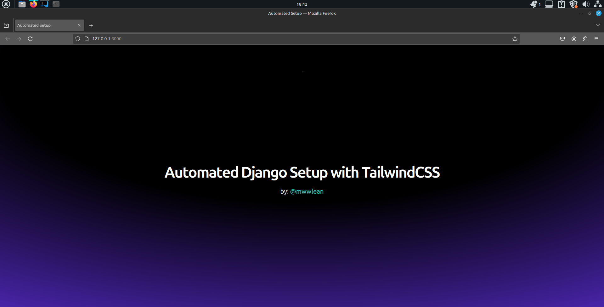

# Automated Django Setup with TailwindCSS

This project automates the process of setting up a Django project integrated with TailwindCSS and Django Compressor.

## Features

- **TailwindCSS** for styling and responsive design.
- **Django Compressor** to optimize and minify CSS for better performance.
- Pre-configured static files and a `dev` script for development.

## Requirements

Make sure you have the following installed on your computer:

- **Python** (>=3.7): [Download Python](https://www.python.org/downloads/)
- **Django** (>=3.2): Install via pip:

  ```bash
  pip install Django
  ```

- **Node.js** (>=14.x): [Download Node.js](https://nodejs.org/en/)
- **npm**: Comes with Node.js.

## Installation via PyPI

You can install the Django TailwindCSS Automated Setup package via PyPI using `pip`:

```bash
pip install django-tailwindcss-automated
```

## Usage

After installing the package, you can set up your Django project with TailwindCSS by running the following command:

```bash
automate
```

This will prompt you to enter the name of your Django project.

### Example:

```bash
$ automate
Enter your project name: my_project
```

The script will automatically:

- Set up static folders and create a base template.
- Configure TailwindCSS and generate `tailwind.config.js`.
- Add a `dev` script to your `package.json`.

## Steps

### 1. Start the TailwindCSS Watcher

Once the setup is complete, navigate to your project directory and run:

```bash
npm run dev
```

This will watch for changes to the `input.css` file and compile TailwindCSS.

### 2. Start the Development Server

In a separate terminal window, run:

```bash
python manage.py runserver
```

This will start the Django development server.

## Customizing Your Project

- **Static Files**: Add your custom styles and scripts inside the `static/src/` folder.
- **Tailwind Config**: Adjust TailwindCSS settings by modifying the `tailwind.config.js` file.

## License

This project is licensed under the MIT License.